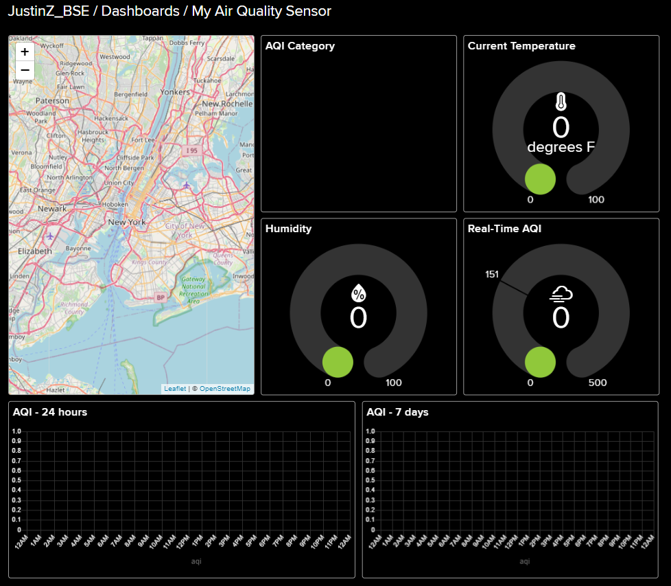
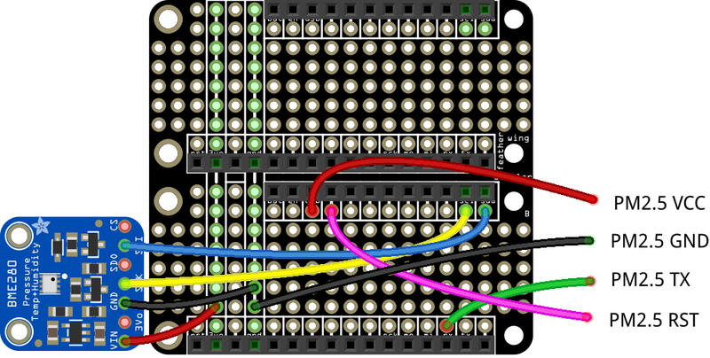
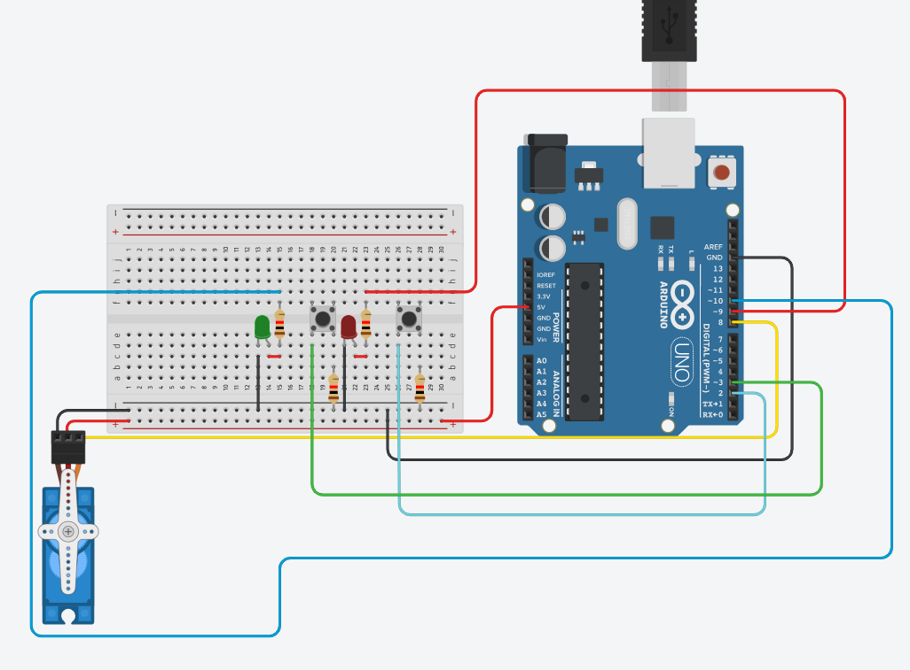

# IoT Air Pollution Monitor
<!---
Replace this text with a brief description (2-3 sentences) of your project. This description should draw the reader in and make them interested in what you've built. You can include what the biggest challenges, takeaways, and triumphs from completing the project were. As you complete your portfolio, remember your audience is less familiar than you are with all that your project entails!

The IoT Air Pollution Monitor monitors the air quality, and sends the data out to the internet as an open source sensor. It is controlled via CircuitPython to allow it to function

You should comment out all portions of your portfolio that you have not completed yet, as well as any instructions:
-->


| **Engineer** | **School** | **Area of Interest** | **Grade** |
|:--:|:--:|:--:|:--:|
| Justin Z | Evergreen Valley High School | Electrical Engineering | Rising Senior

<!--
The image of myself and my completed project will come in the future. Follow the guide [here](https://tomcam.github.io/least-github-pages/adding-images-github-pages-site.html) if you need help.**
-->


<!---
# Final Milestone - Not Started

**Don't forget to replace the text below with the embedding for your milestone video. Go to Youtube, click Share -> Embed, and copy and paste the code to replace what's below.**

<iframe width="560" height="315" src="https://www.youtube.com/embed/F7M7imOVGug" title="YouTube video player" frameborder="0" allow="accelerometer; autoplay; clipboard-write; encrypted-media; gyroscope; picture-in-picture; web-share" allowfullscreen></iframe>

For your final milestone, explain the outcome of your project. Key details to include are:
- What you've accomplished since your previous milestone
- What your biggest challenges and triumphs were at BSE
- A summary of key topics you learned about
- What you hope to learn in the future after everything you've learned at BSE


# Second Milestone - Not Started

**Don't forget to replace the text below with the embedding for your milestone video. Go to Youtube, click Share -> Embed, and copy and paste the code to replace what's below.**

<iframe width="560" height="315" src="https://www.youtube.com/embed/y3VAmNlER5Y" title="YouTube video player" frameborder="0" allow="accelerometer; autoplay; clipboard-write; encrypted-media; gyroscope; picture-in-picture; web-share" allowfullscreen></iframe>

For your second milestone, explain what you've worked on since your previous milestone. You can highlight:
- Technical details of what you've accomplished and how they contribute to the final goal
- What has been surprising about the project so far
- Previous challenges you faced that you overcame
- What needs to be completed before your final milestone 

# First Milestone

**Don't forget to replace the text below with the embedding for your milestone video. Go to Youtube, click Share -> Embed, and copy and paste the code to replace what's below.**

<iframe width="560" height="315" src="https://www.youtube.com/embed/h87ni0UHs0o?si=HWhMT00cOCrQPvNf" title="YouTube video player" frameborder="0" allow="accelerometer; autoplay; clipboard-write; encrypted-media; gyroscope; picture-in-picture; web-share" allowfullscreen></iframe>

My project is an IoT Air Pollution Monitor. It will be primarily controlled by an external device via CircuitPython. 
- An explanation about the different components of your project and how they will all integrate together
- Technical progress you've made so far
- Challenges you're facing and solving in your future milestones
- What your plan is to complete your project

My main project, an IoT Air Pollution Monitor, gauges the air quality index, humidity, and temperature, and is controlled by an external device via CircuitPython. Thus, to effectively complete the project, it is necessary to understand CircuitPython as well as the air quality monitor itself.

Since the project is an IoT (Internet of Things) device, it requires an internet connection, as well as an AC outlet. The air pollution monitor utilizes an open source sensor, as sending data to a company's web service only works until that certain company goes out of business.

For my first milestone, I accessed the Adafruit.IO website and created an air quality sensor group. In that group, I created multiple feeds, including aqi (air quality index), category (description of the air quality), humidity, and temperature. These feeds were used to update blocks on the actual app. On the Adafruit.IO dashboard, I added graphs which showed the feeds. The Adafruit dashboard was a way to essentially develop an app.

My dashboard ended up in this layout. I added the map, but during the creation of the project I was not sure I needed it.


After doing the setup for the dashboard, I needed to wire together the sensors, as making the connections between the hardware and the software cannot be done without the hardware. I attached cables to my BME280 and PMS5003 Adaptor, which was essential for them to be connected to the Adafruit doubler.

Here is the setup for my connections to the Adafruit doubler. These connections are essential for the next steps. For example, the ground ports on both of the components are connected to a single rail on the doubler, meaning that rail will serve as the ground rail.


-->

# Starter Project

## Summary
My starter project is the Arduino Starter. My Arduino Starter utlizies a servo, which is controlled to spin clockwise or counter clockwise by two different buttons. When spinning counter clockwise, the red LED lights up, and when spinning clockwise, the green LED lights up. The arduino stops spinning after a certain angle, and is purposely limited between 30 and 150 degrees. However, this portion of code can be easily adjusted if necessary. When the arduino stops spinning, the LEDs are turned off.

## Design
By linking the buttons to the Arduino UNO signal ports instead of the 5V rail, the buttons can control the LEDs and the servo without being directly linked to it. Thus, all inputs and outputs have their own ports. The main Arduino UNO controls most of the actions via code since the system relies on the ports. For example, the pushbuttons are set to LOW input when pushed, and once detected as LOW, the Arduino UNO sends a HIGH output to the port connected to the red LED.

The breadboard layout of my Arduino Starter shows how most of the components are linked to the Arduino UNO signal ports.


*This diagram was created by me via Tinkercad*

The code is shown below. Without the code, the Arduino UNO would not know what to do with the cables plugged into its port.
```c++
// C++ code
int counterClockWiseButton = 2;   //pin of the first button
int clockWiseButton = 3;  //pin  of the second button
#define LED_1_PIN 9
#define LED_2_PIN 10
#define BUTTON_PIN 4
#include<Servo.h> //include the servo library
Servo servo;  //create a servo object
int pos = 90;  //initial position of the servo
void  setup() {
  // put your setup code here, to run once:
  servo.attach(8);  //pin  used by the servo
  pinMode(counterClockWiseButton, INPUT_PULLUP);  //define first button as  input pullup
  pinMode(clockWiseButton, INPUT_PULLUP); //define second button as input pullup
  pinMode(LED_1_PIN, OUTPUT);
  pinMode(LED_2_PIN, OUTPUT);
  /*
  INPUT_PULLUP send to arduino LOW signal, so, when you press  the button, you send a LOW signal to arduino
  */
}

void loop() {
  // put your main code here, to run repeatedly:
  if ((digitalRead(counterClockWiseButton) ==  LOW)&&(pos < 150)) { //if Value read of the button ==LOW:
    digitalWrite(LED_1_PIN, HIGH);
    pos++;  //increases the value  of the "pos" variable each time the push button of the left is pressed
    delay(10);  //5 milliseconds of delay
    servo.write(pos); //servo goes to variable pos
  }else{
    digitalWrite(LED_1_PIN, LOW);
  }
  if ((digitalRead(clockWiseButton) == LOW)&&(pos > 30)) { //if Value read of the button ==LOW:
    digitalWrite(LED_2_PIN, HIGH);
    pos--;  //decreases the value of the "pos" variable each time the push button  of the right is pressed
    delay(10); //5 milliseconds of delay
    servo.write(pos);  //servo goes to variable pos
  }
  else{
    digitalWrite(LED_2_PIN, LOW);
  }
}
```

After designing and testing the arduino starter on a breadboard, which resulted in a success, I moved the system from a breadboard to an Arduino protoshield, which can be fit ontop of the Arduino UNO. I soldered the components onto the shield, except for the signal cable on the servo as it was not directly linked to the board.

## Challenges 

While designing the layout and system was simple, it was difficult to correctly solder on the components, especially the clockwise system. As an example, during the setup of my project, there was a poor connection between a resistor and a button. Since the resistor was connected to the main ground rail, the entire program didn't work as intended. At first, I thought the LEDs not working was because of a bad LED connection, but it was linked to the bad resistor-button connection. After fixing the connection between the bad resistor and button using solder paster, the entire system worked again. A modification in the future would be using either more soldering wire or a special type of paste to help the wires become more stable, as well as reinforcing the connections underneath the shield.


## Demonstration

This is a demonstration video of my starter Arduino project.

<iframe width="560" height="315" src="https://www.youtube.com/embed/h87ni0UHs0o?si=HWhMT00cOCrQPvNf" title="YouTube video player" frameborder="0" allow="accelerometer; autoplay; clipboard-write; encrypted-media; gyroscope; picture-in-picture; web-share" referrerpolicy="strict-origin-when-cross-origin" allowfullscreen></iframe>


<!---
# Schematics 
Here's where you'll put images of your schematics. [Tinkercad](https://www.tinkercad.com/blog/official-guide-to-tinkercad-circuits) and [Fritzing](https://fritzing.org/learning/) are both great resoruces to create professional schematic diagrams, though BSE recommends Tinkercad becuase it can be done easily and for free in the browser. 

# Code
Here's where you'll put your code. The syntax below places it into a block of code. Follow the guide [here]([url](https://www.markdownguide.org/extended-syntax/)) to learn how to customize it to your project needs. 

```c++
void setup() {
  // put your setup code here, to run once:
  Serial.begin(9600);
  Serial.println("Hello World!");
}

void loop() {
  // put your main code here, to run repeatedly:

}
```

# Bill of Materials
Here's where you'll list the parts in your project. To add more rows, just copy and paste the example rows below.
Don't forget to place the link of where to buy each component inside the quotation marks in the corresponding row after href =. Follow the guide [here]([url](https://www.markdownguide.org/extended-syntax/)) to learn how to customize this to your project needs. 

| **Part** | **Note** | **Price** | **Link** |
|:--:|:--:|:--:|:--:|
| Item Name | What the item is used for | $Price | <a href="https://www.amazon.com/Arduino-A000066-ARDUINO-UNO-R3/dp/B008GRTSV6/"> Link </a> |
| Item Name | What the item is used for | $Price | <a href="https://www.amazon.com/Arduino-A000066-ARDUINO-UNO-R3/dp/B008GRTSV6/"> Link </a> |
| Item Name | What the item is used for | $Price | <a href="https://www.amazon.com/Arduino-A000066-ARDUINO-UNO-R3/dp/B008GRTSV6/"> Link </a> |

# Other Resources/Examples
One of the best parts about Github is that you can view how other people set up their own work. Here are some past BSE portfolios that are awesome examples. You can view how they set up their portfolio, and you can view their index.md files to understand how they implemented different portfolio components.
- [Example 1](https://trashytuber.github.io/YimingJiaBlueStamp/)
- [Example 2](https://sviatil0.github.io/Sviatoslav_BSE/)
- [Example 3](https://arneshkumar.github.io/arneshbluestamp/)


To watch the BSE tutorial on how to create a portfolio, click here.
-->
