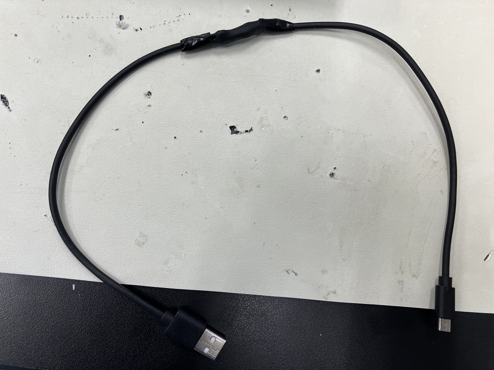

# IoT Air Pollution Monitor

The IoT (Internet of Things) Air Pollution Monitor records AQ (air quality) data from the PM2.5 sensor, as well as humidity & temperature from the BME280 sensor, then uploads them to Adafruit IO. The uploaded data is then displayed on the webpage, updating as often as the device uploads to Adafruit. It also comes fitted with a WiFi LED to show the status, as well as a piezo buzzer when the air quality becomes too hazardous.

| **Engineer** | **School** | **Area of Interest** | **Grade** |
|:--:|:--:|:--:|:--:|
| Justin Z | Evergreen Valley High School | Electrical Engineering | Rising Senior


# Main Project Description

My main project, an IoT Air Pollution Monitor, gauges the air quality index, humidity, and temperature, and is controlled by an external device via CircuitPython. Thus, to effectively complete the project, it is necessary to understand CircuitPython as well as the air quality monitor itself.

Since the project is an IoT (Internet of Things) device, it requires an internet connection, as well as an AC outlet. The air pollution monitor utilizes an open source sensor, as sending data to a company's web service only works until that certain company goes out of business. That is the reason to use Adafruit IO, a website that allows me to create my own system that takes data from feeds. My IoT Air Pollution Monitor will upload data to the feeds, which will be displayed via the interface on the website.


# Starter Project

## Summary
My starter project is the Arduino Starter. My Arduino Starter utlizies a servo, which is controlled to spin clockwise or counter clockwise by two different buttons. When spinning counter clockwise, the red LED lights up, and when spinning clockwise, the green LED lights up. The arduino stops spinning after a certain angle, and is purposely limited between 30 and 150 degrees. However, this portion of code can be easily adjusted if necessary. When the arduino stops spinning, the LEDs are turned off.

## Design
By linking the buttons to the Arduino UNO signal ports instead of the 5V rail, the buttons can control the LEDs and the servo without being directly linked to it. Thus, all inputs and outputs have their own ports. The main Arduino UNO controls most of the actions via code since the system relies on the ports. For example, the pushbuttons are set to LOW input when pushed, and once detected as LOW, the Arduino UNO sends a HIGH output to the port connected to the red LED.

The breadboard layout of my Arduino Starter shows how most of the components are linked to the Arduino UNO signal ports.


*This diagram was created by me via Tinkercad*

The code is shown below. Without the code, the Arduino UNO would not know what to do with the cables plugged into its port.
```c++
// C++ code
int counterClockWiseButton = 2;   //pin of the first button
int clockWiseButton = 3;  //pin  of the second button
#define LED_1_PIN 9
#define LED_2_PIN 10
#define BUTTON_PIN 4
#include<Servo.h> //include the servo library
Servo servo;  //create a servo object
int pos = 90;  //initial position of the servo
void  setup() {
  // put your setup code here, to run once:
  servo.attach(8);  //pin  used by the servo
  pinMode(counterClockWiseButton, INPUT_PULLUP);  //define first button as  input pullup
  pinMode(clockWiseButton, INPUT_PULLUP); //define second button as input pullup
  pinMode(LED_1_PIN, OUTPUT);
  pinMode(LED_2_PIN, OUTPUT);
  /*
  INPUT_PULLUP send to arduino LOW signal, so, when you press  the button, you send a LOW signal to arduino
  */
}

void loop() {
  // put your main code here, to run repeatedly:
  if ((digitalRead(counterClockWiseButton) ==  LOW)&&(pos < 150)) { //if Value read of the button ==LOW:
    digitalWrite(LED_1_PIN, HIGH);
    pos++;  //increases the value  of the "pos" variable each time the push button of the left is pressed
    delay(10);  //5 milliseconds of delay
    servo.write(pos); //servo goes to variable pos
  }else{
    digitalWrite(LED_1_PIN, LOW);
  }
  if ((digitalRead(clockWiseButton) == LOW)&&(pos > 30)) { //if Value read of the button ==LOW:
    digitalWrite(LED_2_PIN, HIGH);
    pos--;  //decreases the value of the "pos" variable each time the push button  of the right is pressed
    delay(10); //5 milliseconds of delay
    servo.write(pos);  //servo goes to variable pos
  }
  else{
    digitalWrite(LED_2_PIN, LOW);
  }
}
```

After designing and testing the arduino starter on a breadboard, which resulted in a success, I moved the system from a breadboard to an Arduino protoshield, which can be fit ontop of the Arduino UNO. I soldered the components onto the shield, except for the signal cable on the servo as it was not directly linked to the board.

## Challenges 

While designing the layout and system was simple, it was difficult to correctly solder on the components, especially the clockwise system. As an example, during the setup of my project, there was a poor connection between a resistor and a button. Since the resistor was connected to the main ground rail, the entire program didn't work as intended. At first, I thought the LEDs not working was because of a bad LED connection, but it was linked to the bad resistor-button connection. After fixing the connection between the bad resistor and button using solder paster, the entire system worked again. A modification in the future would be using either more soldering wire or a special type of paste to help the wires become more stable, as well as reinforcing the connections underneath the shield.


## Demonstration

This is a demonstration video of my starter Arduino project.

<iframe width="560" height="315" src="https://www.youtube.com/embed/h87ni0UHs0o?si=HWhMT00cOCrQPvNf" title="YouTube video player" frameborder="0" allow="accelerometer; autoplay; clipboard-write; encrypted-media; gyroscope; picture-in-picture; web-share" referrerpolicy="strict-origin-when-cross-origin" allowfullscreen></iframe>

# First Milestone

## Physical Setup
For my first milestone, I worked on the physical setup of the project. The BME280 and PMS5003 Adaptor needed to be wired to the Adafruit Doubler. The Adafruit Doubler is the main board for the project, as later I would set up the Adafruit Feather M4 and the Adafruit AirLift Featherwing. The PM2.5 Sensor is linked to the PMS5003 Adaptor (as they both came in the same package.)

Here is the setup for my connections to the Adafruit doubler. These connections are essential for the next steps. For example, the ground ports on both of the components are connected to a single rail on the doubler, meaning that rail will serve as the ground rail.


*It is better to use colored wired for replication purposes. The red & black wire is the connection between the PMS5003 and the PM2.5 Sensor.*


The key connections made between the board and the BME280 were:
* Board 3V to sensor VIN
* Board 3V to sensor CS
* Board GND to sensor GND
* Board SCL to sensor SCK
* Board SDA to sensor SDI

The key connections made between the board and the PMS5003 were:
* Board 5V to sensor VCC
* Board GND to sensor GND
* Board RX to sensor TX
* Board Port 13 to sensor RST

After the wiring was done, I added the Adafruit AirLift Featherwing ontop of the wires, then the Adafruit Feather M4 on the other portion of the Doubler. The AirLift Featherwing allows the board to set up communication via WiFi, and the Feather M4 allows the board to be controlled via CircuitPython.


## What's Next
As of the First Milestone, the hardware was assembled, outside of the enclosure and power supply. CircuitPython needed to be setup, as well as the WiFi communication, in order for the project to function at its base form. The enclosure and power supply was saved for later since they were more rigourous and didn't require circuit knowledge. Since I only soldered the ends of the rods to the Adafruit boards, and not the direct connection between the rods and the ports, I can temporarily remove them if I need to make adjustments with my Doubler.

## Challenges
The silicon wires, while very thin, were much more difficult that other wires to solder in the ports, as it split into multiple strands and needed special tools to split the wires and remove the silicon cover at the ends. There isn't really a need for them, when they can be replaced with colored, separate wires.

Additionally, the guide isn't very specific and makes a couple of messups throughout the article, enough to instill distrust in every single step. This means I need to be more careful during milestones 2 & 3.

## Video

<iframe width="560" height="315" src="https://www.youtube.com/embed/B9a5Sim8IEY?list=PLe-u_DjFx7evDJ6N_vX36J16ru7SvHV5m" title="Justin Z. First Milestone" frameborder="0" allow="accelerometer; autoplay; clipboard-write; encrypted-media; gyroscope; picture-in-picture; web-share" referrerpolicy="strict-origin-when-cross-origin" allowfullscreen></iframe>

# Second Milestone

## Dashboard
For my second milestone, I accessed the Adafruit.IO website and created an air quality sensor group. In that group, I created multiple feeds, including aqi (air quality index), category (description of the air quality), humidity, and temperature. These feeds were used to update blocks on the actual app. On the Adafruit.IO dashboard, I added graphs which showed the feeds. The Adafruit dashboard was a way to essentially develop an app.

When you create an Adafruit IO account, you are given an Adafruit Username and IO key. Save those somewhere, and don't lose them!

My dashboard ended up in this layout. I added the map, but during the creation of the project it wasn't exactly necessary, but still not a bad feature.


*With the dashboard completed, all I needed was code that took data from the sensors and uploaded it to the feeds.*

## CircuitPython & Code Setup
While CircuitPython is a key element for many electronic devices, CircuitPython comes in different forms, and I needed to find the version which was suitable for my Feather M4 Express (the chip that actually handles the program of my device.) After selecting the Feather M4 Express, I downloaded the latest stable uf2 file, which was version 9.0.5.


Upon plugging in my device into my computer, I gained access to the CIRCUITPY drive. Inside the lib folder, I installed multiple files from <a href="https://github.com/adafruit/Adafruit_CircuitPython_Bundle"> Adafruit's CircuitPython library bundle</a>. These files are essential imports to the code, and all should be installed for replication purposes. <br />
<br />

*After installing a github file, I simply copy that file and put it into the lib folder in the CIRCUITPY drive. It is very convenient to open multiple file explorer apps at the same time for an easier file setup.*
<br />
<br />
While other code editors should be suitable, I chose Mu editor as it was a very basic and easy to control. Then, in the CIRCUITPY drive, I created a file named code.py, right next to the lib, sd, and .fseventsd folders, as well as the other files. Next to the code.py file, I made a secrets.py file, where it was used to store my ssid, password, timezone, Adafruit IO username, Adafruit IO password, and the latitude, longitude, and elevation of my city. The proper time zone formats can be found <a href="https://worldtimeapi.org/timezones"> here</a>.


Don't share this file with anybody else!

## Connecting to the IO
Nothing can be uploaded to Adafruit IO without the internet. Thus, saving the WiFi SSID and passwords of locations the device will be used in is important (that's what part of the secrets.py file is for!)

Here's what my python code looks like. We import secrets from our secrets file and use the wifi.connect() call to try to connect to the wifi. Since connection can falter sometimes, the program retrys upon connection failure.

```python
import time
import board
import busio
from digitalio import DigitalInOut, Direction, Pull
from adafruit_esp32spi import adafruit_esp32spi, adafruit_esp32spi_wifimanager
from adafruit_io.adafruit_io import IO_HTTP
from simpleio import map_range
from adafruit_pm25.uart import PM25_UART
from adafruit_bme280 import basic as adafruit_bme280
import supervisor
import gc
import adafruit_pm25
import adafruit_bme280
from adafruit_bme280 import basic as adafruit_bme280

### WiFi ###
# Get wifi details and more from a secrets.py file
try:
    from secrets import secrets
except ImportError:
    print("WiFi secrets are kept in secrets.py, please add them there!")
    raise

# AirLift FeatherWing
esp32_cs = DigitalInOut(board.D13)
#esp32_cs = DigitalInOut(board.D9) <-- if you have trouble with the ports, try this code instead.
esp32_ready = DigitalInOut(board.D11)
esp32_reset = DigitalInOut(board.D12)
esp32_gpio0 = DigitalInOut(board.D10)
spi = busio.SPI(board.SCK, board.MOSI, board.MISO)
esp = adafruit_esp32spi.ESP_SPIcontrol(
    spi, esp32_cs, esp32_ready, esp32_reset, esp32_gpio0
)

wifi = adafruit_esp32spi_wifimanager.ESPSPI_WiFiManager(esp, secrets, status_pixel=None, attempts=4)
print("Connecting to WiFi...")
wifi.connect()
print("Connected to WiFi with IP Address:", wifi.esp.pretty_ip(wifi.esp.ip_address))
reset_pin = DigitalInOut(board.D9)
reset_pin.direction = Direction.OUTPUT
uart = busio.UART(board.TX, board.RX, baudrate=9600)
pm25 = PM25_UART(uart, reset_pin)

# Create i2c object
i2c = board.I2C()

# Connect to a BME280 over I2C
bme280 = adafruit_bme280.Adafruit_BME280_I2C(i2c, address=0x77)

# Create an instance of the Adafruit IO HTTP client
io = IO_HTTP(secrets["aio_username"], secrets["aio_key"], wifi)

# Describes feeds used to hold Adafruit IO data
feed_aqi = io.get_feed("air-quality-sensor.aqi")
feed_aqi_category = io.get_feed("air-quality-sensor.category")
feed_humidity = io.get_feed("air-quality-sensor.humidity")
feed_temperature = io.get_feed("air-quality-sensor.temperature")

# Set up location metadata from secrets.py file
location_metadata = {
    "lat": secrets["latitude"],
    "lon": secrets["longitude"],
    "ele": secrets["elevation"],
}
```
This code imports the files from secrets as well as the other files installed earlier. Then, it stores important data (such as location data, wifi passwords) for later usage. It also keeps tracks of the ports where the hardware was connected so it can be easily called for later usage.

## What's Next
Now with the connection set up, the device can communicate with the Adafruit IO page. Code should be written that samples the data from the sensors, calculates the AQI, and uploads all of it to the IO page. A weatherproof enclosure, as well as other modifications, are the next steps to finalize the project as well.

## Challenges
The greatest challenge comes to upload the right files to the CIRCUITPY drive. The zipped files from where the files are extracted and copied to the CIRCUITPY drive should come from the version that matches the version of CircuitPython. CircuitPython covers a multitude of factors in devices, and both the BME280 and PM2.5 is only a fraction of the files that the CircuitPython library offers.

## Video
<iframe width="560" height="315" src="https://www.youtube.com/embed/cXpkotENVdY?list=PLe-u_DjFx7evDJ6N_vX36J16ru7SvHV5m" title="Justin Z. Second Milestone" frameborder="0" allow="accelerometer; autoplay; clipboard-write; encrypted-media; gyroscope; picture-in-picture; web-share" referrerpolicy="strict-origin-when-cross-origin" allowfullscreen></iframe>

# Third Milestone
For the third milestone, the code that makes the device fully work will be written. Once the code is written and saved to the device, connecting it to a power source and pressing the restart button should let the code continue to work, as long as a power source is connected. 

## Understanding how AQI works
While temperature and humidity can easily be measured via bme280.temperature and bme280.humidity, the PM2.5 sensor doesn't directly measure AQI as easily. Instead, it measures various factors, such as 'pm10 environment', 'pm100 environment', 'pm100 standard', 'particles 03um', 'pm25 standard', and more. AQI can be calculted from the pm2.5 environment factor, known as 'pm25 env' in the code. The values of 'pm25 env', from 0 to 12, can be mapped to an AQI ranging from 0 to 50. While mapping seems difficult, the map_range command was imported from the simpleio file as listed earlier. 'pm25 env' values from 12 to 35.4 can be mapped to an AQI ranging from 51 to 100, and so on.

We can make a simple function that finds the AQI of our environment sensor reading using multiple if/else statements.
```python
def calculate_aqi(pm_sensor_reading):
  try:
        if 0.0 <= pm_sensor_reading <= 12.0:
            # AQI calculation using EPA breakpoints (Ilow-IHigh)
            aqi_val = map_range(int(pm_sensor_reading), 0, 12, 0, 50)
            aqi_cat = "Good"
        elif 12.1 <= pm_sensor_reading <= 35.4:
            aqi_val = map_range(int(pm_sensor_reading), 12, 35, 51, 100)
            aqi_cat = "Moderate"
        elif 35.5 <= pm_sensor_reading <= 55.4:
            aqi_val = map_range(int(pm_sensor_reading), 36, 55, 101, 150)
            aqi_cat = "Unhealthy for Sensitive Groups"
        elif 55.5 <= pm_sensor_reading <= 150.4:
            aqi_val = map_range(int(pm_sensor_reading), 56, 150, 151, 200)
            aqi_cat = "Unhealthy"
        elif 150.5 <= pm_sensor_reading <= 250.4:
            aqi_val = map_range(int(pm_sensor_reading), 151, 250, 201, 300)
            aqi_cat = "Very Unhealthy"
        elif 250.5 <= pm_sensor_reading <= 350.4:
            aqi_val = map_range(int(pm_sensor_reading), 251, 350, 301, 400)
            aqi_cat = "Hazardous"
        elif 350.5 <= pm_sensor_reading <= 500.4:
            aqi_val = map_range(int(pm_sensor_reading), 351, 500, 401, 500)
            aqi_cat = "Very Hazardous"
        else:
            print("Invalid PM2.5 concentration")
            aqi_val = -1
            aqi_cat = None
            print(aqi_val)
            print(aqi_cat)
        return aqi_val, aqi_cat
    except (ValueError, RuntimeError, ConnectionError, OSError) as e:
            print("Unable to read from sensor, retrying...")
            supervisor.reload()
```

## Sampling and Publishing Data
Now that we have a function to find the AQI, all we need to do is take the measurements from the sensors, then upload them to the Adafruit IO page. An example of taking measurements is shown below. While the code does not to follow this exact order, it is important to utilize key functions such as bme280.humidity and bme280.temperature, as well as aqdata["pm25 env"]. Otherwise, setting up a function for just the humidity and temperature isn't necessary.

```python
USE_CELSIUS = False

def read_bme(is_celsius=False):
    """Returns temperature and humidity
    from BME280/BME680 environmental sensor, as a tuple.

    :parameter boolean is_celsius: Returns temperature in degrees celsius
                            if True, otherwise fahrenheit.
    """
    try:
        humid = bme280.humidity
        temp = bme280.temperature
        if not is_celsius:
            temp = temp * 1.8 + 32
        return temp, humid
    except (ValueError, RuntimeError, ConnectionError, OSError) as e:
        print("Failed to fetch time, retrying\n", e)
        supervisor.reload()

def sample_all_sensors():
    try:
        aq_reading = 0
        aq_samples = []

        temp_reading = 0
        temp_samples = []

        humid_reading = 0
        humid_samples = []

        read_tries = 0
        read_attempt_limit = 10

        # initial timestamp
        time_start = time.monotonic()

        # sample pm2.5 sensor over 50 sec sample duration
        # samples only once to avoid rounding errors
        # uses sleep and break commands
        while (time.monotonic() - time_start) <= 50:
            try:
                aqdata = pm25.read()
                print("Raw data")
                print(aqdata)
                aq_samples.append(aqdata["pm25 env"])
                temp_reading, humid_reading = read_bme(USE_CELSIUS)
                temp_samples.append(temp_reading)
                humid_samples.append(humid_reading)
                time.sleep(50)
                break
            except RuntimeError:
                print("RuntimeError while reading pm25, trying again. Attempt: ", read_tries)
                read_tries += 1
                time.sleep(0.1)
        if read_tries >= read_attempt_limit:
            raise RuntimeError
            # pm sensor output rate of 1s
            time.sleep(3)
        # average sample reading / # samples
        try:
            print("Raw Samples")
            print(aq_samples)
            aq_reading = sum(aq_samples) / len(aq_samples)
            temp_reading = sum(temp_samples)/len(temp_samples)
            humid_reading = sum(humid_samples)/len(humid_samples)
            aq_samples = []
            temp_samples = []
            humid_samples = []
            print("AQ Averaged")
            print(aq_reading)
            return aq_reading, temp_reading, humid_reading
        except (ValueError, RuntimeError, ConnectionError, OSError) as e:
                print("Unable to read from sensor, retrying...")
                supervisor.reload()
    except (ValueError, RuntimeError, ConnectionError, OSError) as e:
            print("Unable to read from sensor, retrying...")
            supervisor.reload()

gc.enable()
```

Outside of the function, garbage collection was also enabled, as it is just a nice thing to have, especially with the program heavily relying on error-prone hardware. Supervisor.reload() restarts the entire program. The output of the sample_all_sensors function are 3 different variables, so make sure to account for all of them during the publication. All sensors are sampled every 5 seconds for 50 seconds, which helps keep the sensors active. The sample data goes into a list, which is averaged and cleared at the end of the function. The time.monotonic() helps keep track of accurate time. The read_bme function, which reads the data from the BME280 sensor, has an option for celsius, which is disabled, but can be enabled by setting the USE_CELSIUS variable to true. 

Publication is simple, but make sure that the code accounts for errors using the try & except statements. The statements below are the important statements for publication.
```python
aqi_reading, temperature, humidity = sample_all_sensors()
aqi, aqi_category = calculate_aqi(aqi_reading)

io.send_data(feed_aqi["key"], str(aqi), location_metadata)
io.send_data(feed_aqi_category["key"], aqi_category)
io.send_data(feed_temperature["key"], str(temperature))
io.send_data(feed_humidity["key"], str(humidity))
```
A sleep function of a minute is recommended to not overwork the device or Adafruit IO that manages the uploading of data, or else the code may exceed the data upload rate limit.

## What's Next
Although the code is finished, it can be modified in the future. Most importantly, a 3D-printed weatherproof enclosure is needed for this device to be safely used. Tests in the outside environment should be run to ensure the device can properly run for a full 24 hours.

## Challenges
Writing the code itself was a challenge, since working with the hardware was often unreliable. The code would return inaccurate measurements, as being run too sporadically would result in low AQI values, and being run too frequently would result in high AQI values. Another challenge was dealing with the data upload rate limit for the Adafruit IO.

When testing the device, it is recommended to run it in a suitable environment. The PM 2.5 sensor can sense a consderable distance compared to its size, so even air pollution from a few meters away can result in high environment sensings. 

## Video
<iframe width="560" height="315" src="https://www.youtube.com/embed/3GGz_5pTfrA?list=PLe-u_DjFx7evDJ6N_vX36J16ru7SvHV5m" title="Justin Z. Third Milestone" frameborder="0" allow="accelerometer; autoplay; clipboard-write; encrypted-media; gyroscope; picture-in-picture; web-share" referrerpolicy="strict-origin-when-cross-origin" allowfullscreen></iframe>

# Modifications

Throughout the project, I made multiple modifications in an attempt to make the Air Pollution Monitor more unique and usable. Without them, the air pollution monitor would simply be a bare-bones design. The more modifications meant the better the project, so I spent a while brainstorming potential modifications.

## Enclosure Modification
My 3D printed enclosure would be made with the help of CAD, which means computer aided design. Before CAD, I needed to make certain decisions on how my enclosure would look like. For example, my device needed a source of power, so I had to decide to use a battery, or a wire leading out of the enclosure. I settled on using a rechargable powerbank, which was both a battery and a wire leading out of the enclosure. My enclosure needed a hole for my PM2.5 fan, but if it were too big, then the fan and the device could be exposed to conditions that would cause irreversible damage.

### Blueprint
Before I worked on my CAD Design, I drafted how my project would look like at first. Since CAD accepts both inches and millimeters, my sketch used both of those, since my parts came in both inches and millimeters. My design would use screws to keep my device attached to the walls, so I made screw holes in both the base panel and the lid. I separated the base into 3 compartments, being the device compartment, the power bank compartment, and an additional space used to store excess wires or any additional enclosure modification in the future.

I made two sketches, with my first one getting the measurements of all the components I would use, including screw holes, the device, and the USB length. During this phase, I didn't know what my exact power bank size would be, so I used a variable to represent it. The purpose of the first blueprint was only to remind me of the important dimensions more than the actual CAD design.


<i>Remember that these blueprints are an early design, and that not everything, including the dimensions, were going to be concrete.</i>
<br></br>
My second sketch was a top-down view of the project. This would make my CAD design far easier when following the sketch. The only portions this sketch didn't include was the holes. The purpose of the second sketch was for easy replication, not concrete replication, since certain measurements in the enclosure draft was inaccurate. 


<i>Using both inches and millimeters in a design is very risky and confusing, thus I would recommend to just use millimeters.</i>

### CAD
Utilizing onShape, since it was a free CAD without the need of downloading it, the design could be easily created. The CAD organizes the various components in a top-down list, with the objects at the top happening first. While that sounds simple, it means that the order heavily matters. For example, extrusions can't be organized above the sketch if the extrusion is based on the sketch. Additionally, subtraction booleans, which take two parts and subtract them, have to be ordered below all the extrusions and sketches involved.

First, I started with the base panel. Since I was new to onShape, I learned as I created the design. The sketch used center-point circles of differing diameters, and the holes used booleans. <br></br>


Adding the main body of the design to the panel, tools such as dimensioning and making lines tangent were used.<br></br>


Finally, a lid was added in a separate file. It is important to put non-connected portions in separate files for printing.<br></br>


The CAD designs can be modified in the future in the event of implementing new design-altering modifications.

## Rewritten Code
I was dissatisfied at the code. The code prevented the device from working optimally, as it had a slow and inaccurate measurements. During the time spent creating the device, I often added slight adjustments to the code to help improve its functionality. However, the slight adjustments to variables wasn't enough, and only made the code messier. Thus, it was time to rewrite the entire code, except for a few crucial components (such as the imports.) The entire completed code is shown near the bottom of the portfolio for replication purposes. Thus, this modification section only contains snippets.

### Redefining definitions
An issue I faced was having both AQI category and AQI in the same function. One returned variable could be averaged, while another couldn't. Thus, the calculate_AQI function calculated the averaged PM2.5 readings. However, since map_range didn't work with decimals, the AQI was always rounded (0, 4, 8.3, etc.), meaning there was no in-between. By splitting the functions, I could calculate and average the accurate AQI, then find the category right before publication. 

```python
# calculate AQI with pm25 env function
def calculate_aqi(pm_sensor_reading):
    # Check sensor reading using EPA breakpoint
    try:
        if 0.0 <= pm_sensor_reading <= 12.0:
            # AQI calculation using EPA breakpoints (Ilow-IHigh)
            aqi_val = map_range(int(pm_sensor_reading), 0, 12, 0, 50)
        elif 12.1 <= pm_sensor_reading <= 35.4:
            aqi_val = map_range(int(pm_sensor_reading), 12, 35, 51, 100)
        elif 35.5 <= pm_sensor_reading <= 55.4:
            aqi_val = map_range(int(pm_sensor_reading), 36, 55, 101, 150)
        elif 55.5 <= pm_sensor_reading <= 150.4:
            aqi_val = map_range(int(pm_sensor_reading), 56, 150, 151, 200)
        elif 150.5 <= pm_sensor_reading <= 250.4:
            aqi_val = map_range(int(pm_sensor_reading), 151, 250, 201, 300)
        elif 250.5 <= pm_sensor_reading <= 350.4:
            aqi_val = map_range(int(pm_sensor_reading), 251, 350, 301, 400)
        elif 350.5 <= pm_sensor_reading <= 500.4:
            aqi_val = map_range(int(pm_sensor_reading), 351, 500, 401, 500)
        else:
            if IS_LOGGING:
                print("Invalid PM2.5 AQI")
            # High AQI value to notify calculate_cat even after averaging
            aqi_val = -999999
        return aqi_val
    except (ValueError, RuntimeError, ConnectionError, OSError) as e:
        # notifies that this specific function broke, then restarts program
        if IS_LOGGING:
            print("calculate_AQI error, retrying...")
        supervisor.reload()

# calculates Air Quality category function
# similar to calculate_aqi function except uses AQI as parameter
def calculate_cat(aqi_param):
    try:
        if 0.0 <= aqi_param <= 50:
            aqi_cat = "Good"
        elif 50.1 <= aqi_param <= 100:
            aqi_cat = "Moderate"
        elif 100.1 <= aqi_param <= 150:
            aqi_cat = "Unhealthy for Sensitive Groups"
        elif 150.1 <= aqi_param <= 200:
            aqi_cat = "Unhealthy"
        elif 200.1 <= aqi_param <= 300:
            aqi_cat = "Very Unhealthy"
        elif 300.1 <= aqi_param <= 400:
            aqi_cat = "Hazardous"
        elif 400.1 <= aqi_param <= 500:
            aqi_cat = "Very Hazardous"
        else:
            if IS_LOGGING:
                print("Invalid AQI category")
            aqi_cat = None
            PIEZO_PIN.value = True
        return aqi_cat
    except (ValueError, RuntimeError, ConnectionError, OSError) as e:
        # notifies that this specific function broke, then restarts program
        if IS_LOGGING:
            print("calculate_cat error, retrying...")
        supervisor.reload()
```
These split functions additionally have a new method of handling too high AQ readings. By setting the aqi_val variable (in the calculate_AQI function) to -999999 in the event of a PM2.5 too high, it cannot be averaged to become a normal aqi parameter when being fed into the calculate_cat function. (The AQI is averaged first, before being put into the calculate_cat function. If the range of values was -999999, 100, 100, 100, 100, 100, the average would still trigger the else statement in calculate_cat.)

### Faster sampling time
The original code sampled once every 10 minutes, which is extremely long. I made a modification to sample it every 50 seconds, but that was only once every 50 seconds. Now, the program samples every 9 seconds over a 45 second duration, which means the removal of the break command. A quick snippet of the code is shown below.
```python
while (time.monotonic() - time_start) <= 45:
            try:
                aqdata = pm25.read()
                if IS_LOGGING:
                    print("Raw data")
                    print(aqdata)
                aqi_calculation = calculate_aqi(aqdata["pm25 env"])
                aqi_samples.append(aqi_calculation)
                temp_reading, humid_reading = read_bme(USE_CELSIUS)
                temp_samples.append(temp_reading)
                humid_samples.append(humid_reading)
                time.sleep(9)
```
An additional modification within this snippet is calculating the aqi for every AQ sample from the pm2.5, since the functions were split. More of that is covered in the accurate measurements section.

Speaking of time, certain time usages in the code were removed, as they didn't serve much purpose and were mainly just error-prone clutter. The Adafruit IO marks the time of when the data was recieved, thus time wasn't as important in the code, except for the 45-second measuring interval. Outside of that, the time wasn't necessary.

### Accurate Measurements
Since the AQ is calculated, there isn't a need for an AQ variable or an AQ list. Instead, aqi_calculation and aqi_samples replaced them. In the sample_all_sensors function, the aqi_samples are averaged after the sampling alongside the humidity and temperature. The calculate_cat function isn't used until before publication. 

Sample_all_sensors returns the averaged AQI, Humidity, and Temperature, instead of the averaged aq, humidity, and temperature. This snippet shows where the calculate_cat function is used.
```python
if elapsed_minutes >= PUBLISH_INTERVAL:
            aqi = sum(aqi_array)/len(aqi_array)
            aqi_array = []
            temperature = sum(temp_array)/len(temp_array)
            temp_array = []
            humidity = sum(humid_array)/len(humid_array)
            humid_array = []
            aqi_category = calculate_cat(aqi)

            if IS_LOGGING:
                print("AQI: %d" % aqi)
                print("Category: %s" % aqi_category)
                print("Sampling environmental sensor...")
                print("Temperature: %0.1f F" % temperature)
                print("Humidity: %0.1f %%" % humidity)
                # Publish all values to Adafruit IO
                print("Publishing to Adafruit IO...")

            # Publishing
            # this if/else statement checks if the data is appropriate or from an error
            # only case where aqi is less than 0 is if calculate_aqi read -999999
            # else, it will publish a negative AQI and Invalid category
            if aqi >= -1:
                io.send_data(feed_aqi["key"], str(aqi), location_metadata)
                io.send_data(feed_aqi_category["key"], aqi_category)
            else:
                aqi = -10
                io.send_data(feed_aqi["key"], str(aqi), location_metadata)
                io.send_data(feed_aqi_category["key"], "Invalid")
            io.send_data(feed_temperature["key"], str(temperature))
            io.send_data(feed_humidity["key"], str(humidity))
            if IS_LOGGING:
                print("Published!")
            elapsed_minutes = 0
```
The only inaccurate portion of this is setting the aqi to -10 in the event of a too-high AQ reading. Realistically, the AQI could be any number beyond 150, but my current code is unable to accurately mark the value. For replication purposes, the calculate_aqi and calculate_cat functions can be modified to have extra values for higher AQ levels. For example, the program tends to result in -10 AQI's after a long night of fireworks (since the air quality gets extremely hazardous!)

### Logging
Some snippets include an IS_LOGGING boolean as an if-statement. The original code had a lack of descriptive descriptions and errors. Additionally, there are multiple print functions that while helpful, still can clutter the serial. The IS_LOGGING boolean determines whether to have this commentary printed out or not. 

An example of logging is shown in this snippet:
```python
    except (ValueError, RuntimeError, ConnectionError, OSError) as e:
        # notifies that this specific function broke, then restarts program
        if IS_LOGGING:
            print("sample_all_sensor general error, retrying...")
        supervisor.reload()
```

Additionally commentary and more descriptive print errors were a modification in my code, and while they seem miniscule, they are EXTREMELY helpful in understanding and replicating the code!

## Piezo Buzzer
While the exceptions were created in the calculate_aqi and calculate_cat functions to handle extremely high AQ values (since the original code would result in an error,) beyond-hazardous AQI values are more deadly to people than it is to the device. Thus, a piezo buzzer was implemented as a miniature alarm, similar to a smoke detector.

### Wiring
As the piezo buzzer doesn't require a resistor, the wiring was relatively simple (though wiring with a resistor isn't very difficult either.) The most important part of the piezo is connecting it to an available port, and there were only 2 available ports remaining in the Featherwing Doubler (the esp32 alone requires 4 ports!)


Other than the port, the piezo buzzer is connected to the ground rail. A soldered link was created underneath the board since not every hole was connected in the doubler. This link was between the wire and the Piezo buzzer. 

While this was the first physical modification (other than the enclosure), this modification did not require the enclosure to change its design.

### Code
My buzzer was connected to port5 of the doubler. As the buzzer is an output, setting the value to true would cause a high pitched sound, while setting the value to low would turn it off. 
```python
# Configure Piezo
# Sets to False to ensure it is off
PIEZO_PIN = DigitalInOut(board.D5)
PIEZO_PIN.direction = Direction.OUTPUT
PIEZO_PIN.value = False
```
The appropriate time to enable the buzzer is under the event where the AQ is too high. However, since having the loud buzzer on for too long would more detrimental to people than the hazardous air quality, the buzzer is enabled under the calculate_cat function, then disabled after publication. 

## WiFi LED
While the Arduino Feather M4 lights up to show it is plugged in, it also doesn't show the status of the program. For example, code errors can halt the entire program, but this halting of the program is undetectable. If the program cannot connect to the SSID, or the location it is in doesn't have that SSID, then it will be stuck trying to connect to a different WiFi (just like trying to connecting to your home wifi while across the country.) The WiFi LED lights up when the WiFi is successfully connected, and the LED being off indicates the device should be examined.

### Wiring
The wiring of the LED is similar to the Piezo buzzer, except that it uses a resistor. The position of the resistor doesn't matter if it comes between the power to the LED or between the LED and the ground rail. Additionally, the LED is placed on the Feather M4 itself, thus wires are required to connect between the M4 and the doubler. Hot glue is used to keep the LED in place. This light of this LED is much easier to observe from the top than from the sides.


<i>The green light means the WiFi is connected!</i>

### Code
The LED light was connected to port6 of the doubler, which was the last available port. While the wiring was more difficult, the code was far easier, as the value only needed to be set to true once, after the WiFi was connected. Outside of the startup, the LED is not set to false anywhere else in the program.

```python
# Configure WiFi LED
# Sets to False when program restarts
WIFI_LED = DigitalInOut(board.D6)
WIFI_LED.direction = Direction.OUTPUT
WIFI_LED.value = False
```
### LED Hole
This modification required a change of design in the lid of the enclosure, so it could stick outside of the enclosure. A 5.1 millimeter hole was put in the lid for the LED. For replication purposes, the LED shouldn't be firmly secured into the device until the LED is fitted in the lid. Additionally, another hole, for the BME280, was added to the lid.


<i>A very easy adjustment to the lid.</i>

## Final Assembly
The final assembly wasn't simple. The external small hole for the wire leading outside of the enclosure needed to be spliced. My device couldn't be glued into the ground until the position it was in was suitable for the LED lit to fit in the LED. Even after the LED fit, the wires connecting to the LED had to be firmly secured in place. The BME280 itself was loose and needed to be secured, including its wires (to prevent it from breaking out.)

I modified the CAD to hold more space for the power bank, since while the power bank originally fit, having both ports plugged into the power bank was too wide for the project. Instead, I made the power bank fit diagonally.


<i>The dimensions of the walls didn't change, only the interior walls changed.</i>
<br></br>

<i>The top view of my enclosure before assembly. The brightly colored enclosure helps against the sun on hot days. The lid is outdated as it is missing the BME280 hole.</i>
<br></br>
The final step was to glue it using super glue to prevent the components from tumbling when the device is mounted on a vertical surface. Super glue leaves behind residue upon drying, so be careful with the amount used!


<i>This is the completed project.</i>

## Challenges
Overall, the modifications took longer than the device itself. The biggest challenge was making as many modifications as I could with my available time and ports. During this time I also ordered more parts. The enclosure also limited the modifications in terms of size, since the smaller the enclosure the less bulky the device. During the modification stage, I used multiple tools that I didn't use when assembling the Adafruit doubler, such as the heat gun and the heat shrink.

Another challenge was keeping the interior of the enclosure as accurate as possible to the outside conditions, most importantly in terms of temperature. If the enclosure was hotter than the outside temperature, then the recordings from the BME280 would be inaccurate. While the enclosure itself was a bright color to help reduce the effect of the sun, I wasn't sure if it was enough.

Splicing the wires was a very time-consuming process, and errors meant I would have to cut down and resplice the wires again. Keeping the LED in place was also difficult.


<i>A poorly spliced wire. It stopped working one day after it was spliced.</i>
<br></br>
During the last few days, most of my effort was spent fixing my project, as the components that were used to build the device weeks before had broken down, specifically the silicon wires. The enclosure itself tended to heat up due to the battery as well. It seems that the faulty guide had issues not just inside the software.

## Video

## Triumphs
Bluestamp was a unique learning experience, as in I learned the most through my failures and issues with my project. I tried to ensure that any problems with my project would be resolved within a day. My greatest triumphs were not in the software, but the hardware. Knowing how to not just create devices and sensor chips, but also knowing how to keep them well protected, was a satisfying challenge to overcome. I even got to use the 3D printer, which was something I wasn't able to bring myself to learn in previous years. 

During Bluestamp, I also learned a couple key topics, such as:
<ul>
<li>*How to solder wires</li>
<li>How to use Arduino & Adafruit Doubler</li>
<li>How to make connections outside the breadboard</li>
<li>How to create basic circuits, including LEDs and servos</li>
<li>How to splice wires</li>
<li>How to use CircuitPython</li>
<li>How to use CAD</li>
<li>How to use the PM2.5 and BME280 sensors</li>
</ul>

The more modificiations I added to my project, the more I learned in Bluestamp Engineering. 
<br></br>
## Future Plans
Bluestamp Engineering has given me the necessary foundation to pursue a career in electrical engineering. While I hope to learn more after Bluestamp, such as control theory and more, I'd like to work on environmental sensors as well, such as tornado or ocean probes. These projects focus on how to let the device measure conditions without being directly damaged. Regardless, my air pollution monitor will continue to stay in my backyard, at least until the PM2.5 sensor breaks down from age.

# Final Code

Here is the code for the final IoT Air Quality Sensor, including the modifications. This code won't work without the installed files and hardware setup, including the secrets file, found in milestones 1 & 2.

```python
# imports
import time
import board
import busio
import simpleio
from digitalio import DigitalInOut, Direction, Pull
from adafruit_esp32spi import adafruit_esp32spi, adafruit_esp32spi_wifimanager
from adafruit_io.adafruit_io import IO_HTTP
from simpleio import map_range
from adafruit_pm25.uart import PM25_UART
from adafruit_bme280 import basic as adafruit_bme280
import supervisor
import gc
import adafruit_pm25
import adafruit_bme280
from adafruit_bme280 import basic as adafruit_bme280

# Logging boolean
# There are various prints to serial/console, this enables/disables them
IS_LOGGING = True

# Configure Sensor
# Return environmental sensor readings in degrees Celsius
USE_CELSIUS = False

# Configure Piezo
# Sets to False to ensure it is off
PIEZO_PIN = DigitalInOut(board.D5)
PIEZO_PIN.direction = Direction.OUTPUT
PIEZO_PIN.value = False

# Configure WiFi LED
# Sets to False when program restarts
WIFI_LED = DigitalInOut(board.D6)
WIFI_LED.direction = Direction.OUTPUT
WIFI_LED.value = False


# Sensor Functions

# calculate AQI with pm25 env function
def calculate_aqi(pm_sensor_reading):
    # Check sensor reading using EPA breakpoint
    try:
        if 0.0 <= pm_sensor_reading <= 12.0:
            # AQI calculation using EPA breakpoints (Ilow-IHigh)
            aqi_val = map_range(int(pm_sensor_reading), 0, 12, 0, 50)
        elif 12.1 <= pm_sensor_reading <= 35.4:
            aqi_val = map_range(int(pm_sensor_reading), 12, 35, 51, 100)
        elif 35.5 <= pm_sensor_reading <= 55.4:
            aqi_val = map_range(int(pm_sensor_reading), 36, 55, 101, 150)
        elif 55.5 <= pm_sensor_reading <= 150.4:
            aqi_val = map_range(int(pm_sensor_reading), 56, 150, 151, 200)
        elif 150.5 <= pm_sensor_reading <= 250.4:
            aqi_val = map_range(int(pm_sensor_reading), 151, 250, 201, 300)
        elif 250.5 <= pm_sensor_reading <= 350.4:
            aqi_val = map_range(int(pm_sensor_reading), 251, 350, 301, 400)
        elif 350.5 <= pm_sensor_reading <= 500.4:
            aqi_val = map_range(int(pm_sensor_reading), 351, 500, 401, 500)
        else:
            if IS_LOGGING:
                print("Invalid PM2.5 AQI")
            # High AQI value to notify calculate_cat even after averaging
            aqi_val = -999999
        return aqi_val
    except (ValueError, RuntimeError, ConnectionError, OSError) as e:
        # notifies that this specific function broke, then restarts program
        if IS_LOGGING:
            print("calculate_AQI error, retrying...")
        supervisor.reload()

# calculates Air Quality category function
# similar to calculate_aqi function except uses AQI as parameter
def calculate_cat(aqi_param):
    try:
        if 0.0 <= aqi_param <= 50:
            aqi_cat = "Good"
        elif 50.1 <= aqi_param <= 100:
            aqi_cat = "Moderate"
        elif 100.1 <= aqi_param <= 150:
            aqi_cat = "Unhealthy for Sensitive Groups"
        elif 150.1 <= aqi_param <= 200:
            aqi_cat = "Unhealthy"
        elif 200.1 <= aqi_param <= 300:
            aqi_cat = "Very Unhealthy"
        elif 300.1 <= aqi_param <= 400:
            aqi_cat = "Hazardous"
        elif 400.1 <= aqi_param <= 500:
            aqi_cat = "Very Hazardous"
        else:
            if IS_LOGGING:
                print("Invalid AQI category")
            aqi_cat = None
            PIEZO_PIN.value = True
        return aqi_cat
    except (ValueError, RuntimeError, ConnectionError, OSError) as e:
        # notifies that this specific function broke, then restarts program
        if IS_LOGGING:
            print("calculate_cat error, retrying...")
        supervisor.reload()


# reading temperature and humidity values from the BME280 function
# separate function so easy to configure
# is_celsius boolean
def read_bme(is_celsius=False):
    try:
        humid = bme280.humidity
        temp = bme280.temperature
        if not is_celsius:
            temp = temp * 1.8 + 32
        return temp, humid
    except (ValueError, RuntimeError, ConnectionError, OSError) as e:
        # notifies that this specific function broke, then restarts program
        if IS_LOGGING:
            print("read_bme error, retrying\n", e)
        supervisor.reload()

# samples from all sensors, returns AQI instead of aq_reading
# calculates the AQI within the function
def sample_all_sensors():
    try:
        temp_reading = 0
        temp_samples = []

        humid_reading = 0
        humid_samples = []

        aqi_calculation = 0
        aqi_samples = []

        read_tries = 0
        read_attempt_limit = 10

        # initial timestamp
        time_start = time.monotonic()
        # sample pm2.5 sensor over 45 sec sample duration
        # samples every 9 seconds
        # result is 5 readings for aqi, temp, and humid samples
        while (time.monotonic() - time_start) <= 45:
            try:
                aqdata = pm25.read()
                if IS_LOGGING:
                    print("Raw data")
                    print(aqdata)
                aqi_calculation = calculate_aqi(aqdata["pm25 env"])
                aqi_samples.append(aqi_calculation)
                temp_reading, humid_reading = read_bme(USE_CELSIUS)
                temp_samples.append(temp_reading)
                humid_samples.append(humid_reading)
                time.sleep(9)
            except RuntimeError:
                if IS_LOGGING:
                    print("RuntimeError while reading pm25, trying again. Attempt: ", read_tries)
                read_tries += 1
                time.sleep(0.1)
        if read_tries >= read_attempt_limit:
            raise RuntimeError
            # pm sensor output rate of 1s
            time.sleep(3)
        # average sample reading
        try:
            if IS_LOGGING:
                print("AQI Samples")
                print(aqi_samples)
            aqi_calculation = sum(aqi_samples) / len(aqi_samples)
            temp_reading = sum(temp_samples)/len(temp_samples)
            humid_reading = sum(humid_samples)/len(humid_samples)
            aqi_samples = []
            temp_samples = []
            humid_samples = []
            if IS_LOGGING:
                print("AQI, Temp, Humid Averaged")
                print(aqi_calculation)
                print(temp_reading)
                print(humid_reading)
            return aqi_calculation, temp_reading, humid_reading
        except (ValueError, RuntimeError, ConnectionError, OSError) as e:
            # notifies that this specific function broke, then restarts program
            if IS_LOGGING:
                print("sample_all_sensor return error, retrying...")
            supervisor.reload()
    except (ValueError, RuntimeError, ConnectionError, OSError) as e:
        # notifies that this specific function broke, then restarts program
        if IS_LOGGING:
            print("sample_all_sensor general error, retrying...")
        supervisor.reload()

# enable trash collection
gc.enable()

# Interval the sensor publishes to Adafruit IO
PUBLISH_INTERVAL = 1

### WiFi ###
# Get wifi details and more from a secrets.py file
try:
    from secrets import secrets
except ImportError:
    print("WiFi secrets are kept in secrets.py, please add them there!")
    raise

# AirLift FeatherWing
esp32_cs = DigitalInOut(board.D13)
esp32_ready = DigitalInOut(board.D11)
esp32_reset = DigitalInOut(board.D12)
esp32_gpio0 = DigitalInOut(board.D10)
spi = busio.SPI(board.SCK, board.MOSI, board.MISO)
esp = adafruit_esp32spi.ESP_SPIcontrol(
    spi, esp32_cs, esp32_ready, esp32_reset, esp32_gpio0
)

wifi = adafruit_esp32spi_wifimanager.ESPSPI_WiFiManager(esp, secrets, status_pixel=None, attempts=4)
if IS_LOGGING:
    print("Connecting to WiFi...")
wifi.connect()
if IS_LOGGING:
    print("Connected to WiFi with IP Address:", wifi.esp.pretty_ip(wifi.esp.ip_address))
WIFI_LED.value = True
# Connect to a PM2.5 sensor over UART
reset_pin = DigitalInOut(board.D9)
reset_pin.direction = Direction.OUTPUT
uart = busio.UART(board.TX, board.RX, baudrate=9600)
pm25 = PM25_UART(uart, reset_pin)

# Create i2c object
i2c = board.I2C()

# Connect to a BME280 over I2C
bme280 = adafruit_bme280.Adafruit_BME280_I2C(i2c, address=0x77)

# Create an instance of the Adafruit IO HTTP client
io = IO_HTTP(secrets["aio_username"], secrets["aio_key"], wifi)

# Describes feeds used to hold Adafruit IO data
feed_aqi = io.get_feed("air-quality-sensor.aqi")
feed_aqi_category = io.get_feed("air-quality-sensor.category")
feed_humidity = io.get_feed("air-quality-sensor.humidity")
feed_temperature = io.get_feed("air-quality-sensor.temperature")

# Set up location metadata from secrets.py file
location_metadata = {
    "lat": secrets["latitude"],
    "lon": secrets["longitude"],
    "ele": secrets["elevation"],
}

elapsed_minutes = 0
aqi_array = []
temp_array = []
humid_array = []

while True:
    try:
        if IS_LOGGING:
            print("Fetching time...")
        cur_time = io.receive_time()
        if IS_LOGGING:
            print("Time fetched OK!")
    except (ValueError, RuntimeError, ConnectionError, OSError) as e:
        if IS_LOGGING:
            print("Failed to fetch time, retrying\n", e)
        supervisor.reload()
    try:
        # samples AQI, Temperature, Humidity from all sensors, then adds them to lists
        elapsed_minutes += 1
        if IS_LOGGING:
            print("Sampling all sensors...")
        aqi, temperature, humidity = sample_all_sensors()
        aqi_array.append(aqi)
        temp_array.append(temperature)
        humid_array.append(humidity)
    except (ValueError, RuntimeError, ConnectionError, OSError) as e:
        if IS_LOGGING:
            print("Failed to fetch time, retrying\n", e)
        supervisor.reload()
    try:
        if elapsed_minutes >= PUBLISH_INTERVAL:
            aqi = sum(aqi_array)/len(aqi_array)
            aqi_array = []
            temperature = sum(temp_array)/len(temp_array)
            temp_array = []
            humidity = sum(humid_array)/len(humid_array)
            humid_array = []
            aqi_category = calculate_cat(aqi)

            if IS_LOGGING:
                print("AQI: %d" % aqi)
                print("Category: %s" % aqi_category)
                print("Sampling environmental sensor...")
                print("Temperature: %0.1f F" % temperature)
                print("Humidity: %0.1f %%" % humidity)
                # Publish all values to Adafruit IO
                print("Publishing to Adafruit IO...")

            # Publishing
            # this if/else statement checks if the data is appropriate or from an error
            # only case where aqi is less than 0 is if calculate_aqi read -999999
            # else, it will publish a negative AQI and Invalid category
            if aqi >= -1:
                io.send_data(feed_aqi["key"], str(aqi), location_metadata)
                io.send_data(feed_aqi_category["key"], aqi_category)
            else:
                aqi = -10
                io.send_data(feed_aqi["key"], str(aqi), location_metadata)
                io.send_data(feed_aqi_category["key"], "Invalid")
            io.send_data(feed_temperature["key"], str(temperature))
            io.send_data(feed_humidity["key"], str(humidity))
            if IS_LOGGING:
                print("Published!")
            elapsed_minutes = 0

    except (ValueError, RuntimeError, ConnectionError, OSError) as e:
        if IS_LOGGING:
            print("Failed to send data to IO, retrying\n", e)
        PIEZO_PIN.value = False
        supervisor.reload()
        # Reset timer
    PIEZO_PIN.value = False
    time.sleep(45)

```

# Bill of Materials
I used various components in the creation of my IoT Air Pollution Monitor. However, some materials weren't necessary, as replacing the silicon wire with normal wires could also work, and I improvised for an enclosure by 3D printing my own instead of purchasing one.

| **Part** | **Description** | **Price** | **Link** |
|:--:|:--:|:--:|:--:|
| Adafruit Feather M4 Express | Allows the board to run CircuitPython | $22.95 | <a href="https://www.adafruit.com/product/3857"> Link </a> |
| Adafruit AirLift FeatherWing | Allows the board to process WiFi | $12.95 | <a href="https://www.adafruit.com/product/4264"> Link </a> |
| PM2.5 Air Quality Sensor and Breadboard Adapter Kit | Connects an air quality sensor to the board | $39.95 | <a href="https://www.adafruit.com/product/3686"> Link </a> |
| Adafruit BME280 12C/Temperature Humidity Pressure Sensor | Environment sensors for Temperature & Humidity | $14.95 | <a href="https://www.adafruit.com/product/2652"> Link </a> |
| FeatherWing Doubler | Acts as the main board | $7.50 | <a href="https://www.adafruit.com/product/2890"> Link </a> |
| Silicone Cover Standed-Core Ribbon Cable | Acts as the wires for the board | $1.95 | <a href="https://www.adafruit.com/product/3889"> Link </a> |
| 5V 2A Switching Power Supply | Lets the board connect to power | $7.95 | <a href="https://www.adafruit.com/product/1994"> Link </a> |
| USB A/Micro Cable | Lets the board connect to power | $4.95 | <a href="https://www.adafruit.com/product/2185"> Link </a> |
| QEEUBOVY Quick Charge Power Bank | Acts as the power supply for the device | $13.99 | <a href="https://www.amazon.com/Smallest-Portable-Charging-Competible-Essentials/dp/B0CKNGTDLY/ref=sr_1_16?dib=eyJ2IjoiMSJ9.gxLOXRI_yCUIppyNCwHl6TeBp7PotJ4Y4SjMzGX28EWL_auQkIKWaLGyQvmSUYXcPbkU_giFiG6Dx6xN61tGe28MX6nacov8xSrZVWwTlGAiVW8kmTr6NMOo6DV3kyD_fwulONu5uAwzXuDvCo1GNsi9IwmKSKbFKELhhPJ7EM_dib1yYK-zcXePhyI05JX9u1SdyNYHdUi7kPCRr_rBOTWu-4x54-TvDhoMNm2jOvs.PhOv9jl69UNjX3b_ijdELLd4V4SfUYgQunw33g5935o&dib_tag=se&hvadid=664624701487&hvdev=c&hvlocphy=9061320&hvnetw=g&hvqmt=b&hvrand=3106670759621317154&hvtargid=kwd-297941941862&hydadcr=22005_13484882&keywords=smallest+most+powerful+power+bank&qid=1719530920&sr=8-16"> Link </a> |
| My onShape Enclosure Body Design | Feel free to use the CAD design! | N/A | <a href="https://cad.onshape.com/documents/4c7d1700785509b65d1cce7f/w/9fdd26b679d5dd9a4aba1327/e/a7ddef6cac27536e19806b98?renderMode=0&uiState=669043f805629e529f226994"> Link </a> |
| My onShape Enclosure Lid Design | Feel free to use the CAD design! | N/A | <a href="https://cad.onshape.com/documents/221830d868bfccc7a193d593/w/e68ddbafa327d629cc13ec26/e/c5737b01e29ba991a76d574b?renderMode=0&uiState=669044d4981d710489ba79ab"> Link </a> |


