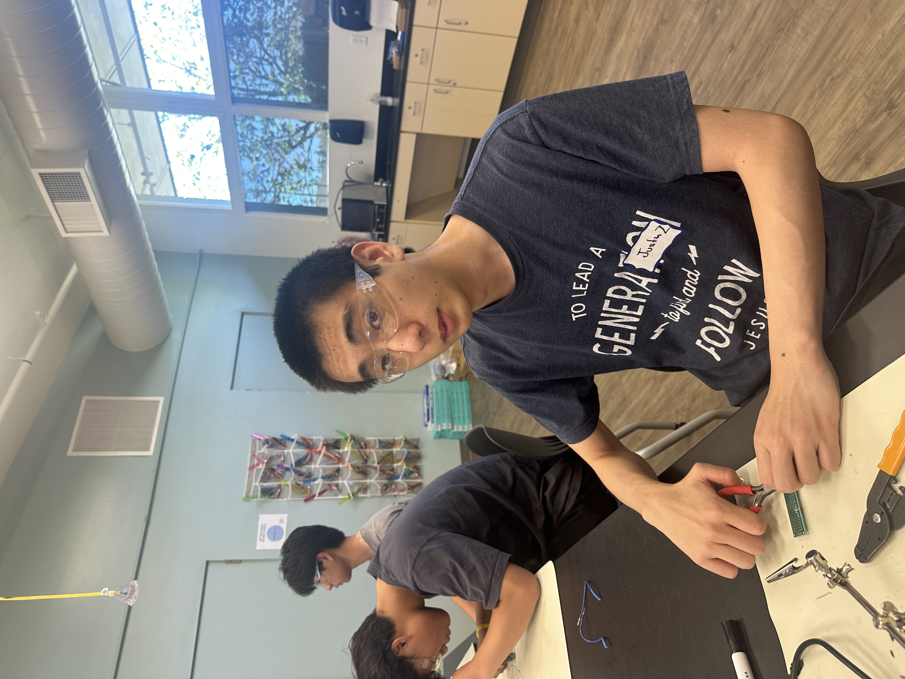

# IoT Air Pollution Monitor
<!---
Replace this text with a brief description (2-3 sentences) of your project. This description should draw the reader in and make them interested in what you've built. You can include what the biggest challenges, takeaways, and triumphs from completing the project were. As you complete your portfolio, remember your audience is less familiar than you are with all that your project entails!

The IoT Air Pollution Monitor monitors the air quality, and sends the data out to the internet as an open source sensor. It is controlled via CircuitPython to allow it to function...
It is meant for indoor home usage.

You should comment out all portions of your portfolio that you have not completed yet, as well as any instructions:
-->


| **Engineer** | **School** | **Area of Interest** | **Grade** |
|:--:|:--:|:--:|:--:|
| Justin Z | Evergreen Valley High School | Electrical Engineering | Rising Senior

<!--
The image of myself and my completed project will come in the future. Follow the guide [here](https://tomcam.github.io/least-github-pages/adding-images-github-pages-site.html) if you need help.**

For your final milestone, explain the outcome of your project. Key details to include are:
- What you've accomplished since your previous milestone
- What your biggest challenges and triumphs were at BSE
- A summary of key topics you learned about
- What you hope to learn in the future after everything you've learned at BSE

MODIFICATION: I WAS UNHAPPY WITH THE WAY MAP_RANGE WORKED, AND AVERAGING THE AQ WOULD BE FLOORED, SO I CHANGED CODE TO MEASURE MULTIPLE AQ AND CALCULATE AQI, THEN ROUND THEM ALL. CALCULATE AQI NOT USED IN WHILE TRUE, INSTEAD USED IN CALCULATE_ALL_SAMPLES FUNCTION. REDESIGNED ENTIRE CODE TO BE EASIER TO READ
MODIFICATION: I ADDED IS_LOGGING BOOLEAN

-->



# Main Project Description
My main project, an IoT Air Pollution Monitor, gauges the air quality index, humidity, and temperature, and is controlled by an external device via CircuitPython. Thus, to effectively complete the project, it is necessary to understand CircuitPython as well as the air quality monitor itself.

Since the project is an IoT (Internet of Things) device, it requires an internet connection, as well as an AC outlet. The air pollution monitor utilizes an open source sensor, as sending data to a company's web service only works until that certain company goes out of business. That is the reason to use Adafruit IO, a website that allows me to create my own system that takes data from feeds. My IoT Air Pollution Monitor will upload data to the feeds, which will be displayed via the interface on the website.

<!--
# Modifications
Throughout the project, I made multiple modifications in an attempt to make the Air Pollution Monitor more unique and usable. Without them, the air pollution monitor would simply be a bare-bones design. The more modifications meant the better the project, so I spent a while brainstorming potential modifications.

## Enclosure Modification
### Blueprint
I used powerbank

### CAD 


## Piezo Buzzer
### Wiring

### Code

## Rewritten Code
I was dissatisfied at the code. The code prevented the device from working optimally, as it had a slow and inaccruate measurements. During the time spent creating the device, I often added slight adjustments to the code to help improve its functionality. However, the slight adjustments to variables wasn't enough, and only made the code messier. Thus, it was time to rewrite the entire code, except for a few crucial components (such as the imports.)
### Remaking definitions
### Faster sampling time
### Accurate Measurements
### Logging

## Challenges
Overall, the modifications took longer than the device itself. 
## Video
-->

# Third Milestone
For the third milestone, the code that makes the device fully work will be written. Once the code is written and saved to the device, connecting it to a power source and pressing the restart button should let the code continue to work, as long as a power source is connected. 

## Understanding how AQI works
While temperature and humidity can easily be measured via bme280.temperature and bme280.humidity, the PM2.5 sensor doesn't directly measure AQI as easily. Instead, it measures various factors, such as 'pm10 environment', 'pm100 environment', 'pm100 standard', 'particles 03um', 'pm25 standard', and more. AQI can be calculted from the pm2.5 environment factor, known as 'pm25 env' in the code. The values of 'pm25 env', from 0 to 12, can be mapped to an AQI ranging from 0 to 50. While mapping seems difficult, the map_range command was imported from the simpleio file as listed earlier. 'pm25 env' values from 12 to 35.4 can be mapped to an AQI ranging from 51 to 100, and so on.

We can make a simple function that finds the AQI of our environment sensor reading using multiple if/else statements.
```python
def calculate_aqi(pm_sensor_reading):
  try:
        if 0.0 <= pm_sensor_reading <= 12.0:
            # AQI calculation using EPA breakpoints (Ilow-IHigh)
            aqi_val = map_range(int(pm_sensor_reading), 0, 12, 0, 50)
            aqi_cat = "Good"
        elif 12.1 <= pm_sensor_reading <= 35.4:
            aqi_val = map_range(int(pm_sensor_reading), 12, 35, 51, 100)
            aqi_cat = "Moderate"
        elif 35.5 <= pm_sensor_reading <= 55.4:
            aqi_val = map_range(int(pm_sensor_reading), 36, 55, 101, 150)
            aqi_cat = "Unhealthy for Sensitive Groups"
        elif 55.5 <= pm_sensor_reading <= 150.4:
            aqi_val = map_range(int(pm_sensor_reading), 56, 150, 151, 200)
            aqi_cat = "Unhealthy"
        elif 150.5 <= pm_sensor_reading <= 250.4:
            aqi_val = map_range(int(pm_sensor_reading), 151, 250, 201, 300)
            aqi_cat = "Very Unhealthy"
        elif 250.5 <= pm_sensor_reading <= 350.4:
            aqi_val = map_range(int(pm_sensor_reading), 251, 350, 301, 400)
            aqi_cat = "Hazardous"
        elif 350.5 <= pm_sensor_reading <= 500.4:
            aqi_val = map_range(int(pm_sensor_reading), 351, 500, 401, 500)
            aqi_cat = "Very Hazardous"
        else:
            print("Invalid PM2.5 concentration")
            aqi_val = -1
            aqi_cat = None
            print(aqi_val)
            print(aqi_cat)
        return aqi_val, aqi_cat
    except (ValueError, RuntimeError, ConnectionError, OSError) as e:
            print("Unable to read from sensor, retrying...")
            supervisor.reload()
```

## Sampling and Publishing Data
Now that we have a function to find the AQI, all we need to do is take the measurements from the sensors, then upload them to the Adafruit IO page. An example of taking measurements is shown below. While the code does not to follow this exact order, it is important to utilize key functions such as bme280.humidity and bme280.temperature, as well as aqdata["pm25 env"]. Otherwise, setting up a function for just the humidity and temperature isn't necessary.

```python
USE_CELSIUS = False

def read_bme(is_celsius=False):
    """Returns temperature and humidity
    from BME280/BME680 environmental sensor, as a tuple.

    :parameter boolean is_celsius: Returns temperature in degrees celsius
                            if True, otherwise fahrenheit.
    """
    try:
        humid = bme280.humidity
        temp = bme280.temperature
        if not is_celsius:
            temp = temp * 1.8 + 32
        return temp, humid
    except (ValueError, RuntimeError, ConnectionError, OSError) as e:
        print("Failed to fetch time, retrying\n", e)
        supervisor.reload()

def sample_all_sensors():
    try:
        aq_reading = 0
        aq_samples = []

        temp_reading = 0
        temp_samples = []

        humid_reading = 0
        humid_samples = []

        read_tries = 0
        read_attempt_limit = 10

        # initial timestamp
        time_start = time.monotonic()

        # sample pm2.5 sensor over 50 sec sample duration
        # samples only once to avoid rounding errors
        # uses sleep and break commands
        while (time.monotonic() - time_start) <= 50:
            try:
                aqdata = pm25.read()
                print("Raw data")
                print(aqdata)
                aq_samples.append(aqdata["pm25 env"])
                temp_reading, humid_reading = read_bme(USE_CELSIUS)
                temp_samples.append(temp_reading)
                humid_samples.append(humid_reading)
                time.sleep(50)
                break
            except RuntimeError:
                print("RuntimeError while reading pm25, trying again. Attempt: ", read_tries)
                read_tries += 1
                time.sleep(0.1)
        if read_tries >= read_attempt_limit:
            raise RuntimeError
            # pm sensor output rate of 1s
            time.sleep(3)
        # average sample reading / # samples
        try:
            print("Raw Samples")
            print(aq_samples)
            aq_reading = sum(aq_samples) / len(aq_samples)
            temp_reading = sum(temp_samples)/len(temp_samples)
            humid_reading = sum(humid_samples)/len(humid_samples)
            aq_samples = []
            temp_samples = []
            humid_samples = []
            print("AQ Averaged")
            print(aq_reading)
            return aq_reading, temp_reading, humid_reading
        except (ValueError, RuntimeError, ConnectionError, OSError) as e:
                print("Unable to read from sensor, retrying...")
                supervisor.reload()
    except (ValueError, RuntimeError, ConnectionError, OSError) as e:
            print("Unable to read from sensor, retrying...")
            supervisor.reload()

gc.enable()
```

Outside of the function, garbage collection was also enabled, as it is just a nice thing to have, especially with the program heavily relying on error-prone hardware. Supervisor.reload() restarts the entire program. The output of the sample_all_sensors function are 3 different variables, so make sure to account for all of them during the publication. All sensors are sampled every 5 seconds for 50 seconds, which helps keep the sensors active. The sample data goes into a list, which is averaged and cleared at the end of the function. The time.monotonic() helps keep track of accurate time. The read_bme function, which reads the data from the BME280 sensor, has an option for celsius, which is disabled, but can be enabled by setting the USE_CELSIUS variable to true. 

Publication is simple, but make sure that the code accounts for errors using the try & except statements. The statements below are the important statements for publication.
```python
aqi_reading, temperature, humidity = sample_all_sensors()
aqi, aqi_category = calculate_aqi(aqi_reading)

io.send_data(feed_aqi["key"], str(aqi), location_metadata)
io.send_data(feed_aqi_category["key"], aqi_category)
io.send_data(feed_temperature["key"], str(temperature))
io.send_data(feed_humidity["key"], str(humidity))
```
A sleep function of a minute is recommended to not overwork the device or Adafruit IO that manages the uploading of data, or else the code may exceed the data upload rate limit.

## What's Next
Although the code is finished, it can be modified in the future. Most importantly, a 3D-printed weatherproof enclosure is needed for this device to be safely used. Tests in the outside environment should be run to ensure the device can properly run for a full 24 hours.

## Challenges
Writing the code itself was a challenge, since working with the hardware was often unreliable. The code would return inaccurate measurements, as being run too sporadically would result in low AQI values, and being run too frequently would result in high AQI values. Another challenge was dealing with the data upload rate limit for the Adafruit IO.

When testing the device, it is recommended to run it in a suitable environment. The PM 2.5 sensor can sense a consderable distance compared to its size, so even air pollution from a few meters away can result in high environment sensings. 

## Video
<iframe width="560" height="315" src="https://www.youtube.com/embed/3GGz_5pTfrA?list=PLe-u_DjFx7evDJ6N_vX36J16ru7SvHV5m" title="Justin Z. Third Milestone" frameborder="0" allow="accelerometer; autoplay; clipboard-write; encrypted-media; gyroscope; picture-in-picture; web-share" referrerpolicy="strict-origin-when-cross-origin" allowfullscreen></iframe>

# Second Milestone

## Dashboard
For my second milestone, I accessed the Adafruit.IO website and created an air quality sensor group. In that group, I created multiple feeds, including aqi (air quality index), category (description of the air quality), humidity, and temperature. These feeds were used to update blocks on the actual app. On the Adafruit.IO dashboard, I added graphs which showed the feeds. The Adafruit dashboard was a way to essentially develop an app.

When you create an Adafruit IO account, you are given an Adafruit Username and IO key. Save those somewhere, and don't lose them!

My dashboard ended up in this layout. I added the map, but during the creation of the project it wasn't exactly necessary, but still not a bad feature.


*With the dashboard completed, all I needed was code that took data from the sensors and uploaded it to the feeds.*

## CircuitPython & Code Setup
While CircuitPython is a key element for many electronic devices, CircuitPython comes in different forms, and I needed to find the version which was suitable for my Feather M4 Express (the chip that actually handles the program of my device.) After selecting the Feather M4 Express, I downloaded the latest stable uf2 file, which was version 9.0.5.


Upon plugging in my device into my computer, I gained access to the CIRCUITPY drive. Inside the lib folder, I installed multiple files from <a href="https://github.com/adafruit/Adafruit_CircuitPython_Bundle"> Adafruit's CircuitPython library bundle</a>. These files are essential imports to the code, and all should be installed for replication purposes. <br />
<br />

*After installing a github file, I simply copy that file and put it into the lib folder in the CIRCUITPY drive. It is very convenient to open multiple file explorer apps at the same time for an easier file setup.*
<br />
<br />
While other code editors should be suitable, I chose Mu editor as it was a very basic and easy to control. Then, in the CIRCUITPY drive, I created a file named code.py, right next to the lib, sd, and .fseventsd folders, as well as the other files. Next to the code.py file, I made a secrets.py file, where it was used to store my ssid, password, timezone, Adafruit IO username, Adafruit IO password, and the latitude, longitude, and elevation of my city. The proper time zone formats can be found <a href="https://worldtimeapi.org/timezones"> here</a>.


Don't share this file with anybody else!

## Connecting to the IO
Nothing can be uploaded to Adafruit IO without the internet. Thus, saving the WiFi SSID and passwords of locations the device will be used in is important (that's what part of the secrets.py file is for!)

Here's what my python code looks like. We import secrets from our secrets file and use the wifi.connect() call to try to connect to the wifi. Since connection can falter sometimes, the program retrys upon connection failure.

```python
import time
import board
import busio
from digitalio import DigitalInOut, Direction, Pull
from adafruit_esp32spi import adafruit_esp32spi, adafruit_esp32spi_wifimanager
from adafruit_io.adafruit_io import IO_HTTP
from simpleio import map_range
from adafruit_pm25.uart import PM25_UART
from adafruit_bme280 import basic as adafruit_bme280
import supervisor
import gc
import adafruit_pm25
import adafruit_bme280
from adafruit_bme280 import basic as adafruit_bme280

### WiFi ###
# Get wifi details and more from a secrets.py file
try:
    from secrets import secrets
except ImportError:
    print("WiFi secrets are kept in secrets.py, please add them there!")
    raise

# AirLift FeatherWing
esp32_cs = DigitalInOut(board.D13)
#esp32_cs = DigitalInOut(board.D9) <-- if you have trouble with the ports, try this code instead.
esp32_ready = DigitalInOut(board.D11)
esp32_reset = DigitalInOut(board.D12)
esp32_gpio0 = DigitalInOut(board.D10)
spi = busio.SPI(board.SCK, board.MOSI, board.MISO)
esp = adafruit_esp32spi.ESP_SPIcontrol(
    spi, esp32_cs, esp32_ready, esp32_reset, esp32_gpio0
)

wifi = adafruit_esp32spi_wifimanager.ESPSPI_WiFiManager(esp, secrets, status_pixel=None, attempts=4)
print("Connecting to WiFi...")
wifi.connect()
print("Connected to WiFi with IP Address:", wifi.esp.pretty_ip(wifi.esp.ip_address))
reset_pin = DigitalInOut(board.D9)
reset_pin.direction = Direction.OUTPUT
uart = busio.UART(board.TX, board.RX, baudrate=9600)
pm25 = PM25_UART(uart, reset_pin)

# Create i2c object
i2c = board.I2C()

# Connect to a BME280 over I2C
bme280 = adafruit_bme280.Adafruit_BME280_I2C(i2c, address=0x77)

# Create an instance of the Adafruit IO HTTP client
io = IO_HTTP(secrets["aio_username"], secrets["aio_key"], wifi)

# Describes feeds used to hold Adafruit IO data
feed_aqi = io.get_feed("air-quality-sensor.aqi")
feed_aqi_category = io.get_feed("air-quality-sensor.category")
feed_humidity = io.get_feed("air-quality-sensor.humidity")
feed_temperature = io.get_feed("air-quality-sensor.temperature")

# Set up location metadata from secrets.py file
location_metadata = {
    "lat": secrets["latitude"],
    "lon": secrets["longitude"],
    "ele": secrets["elevation"],
}
```
This code imports the files from secrets as well as the other files installed earlier. Then, it stores important data (such as location data, wifi passwords) for later usage. It also keeps tracks of the ports where the hardware was connected so it can be easily called for later usage.

## What's Next
Now with the connection set up, the device can communicate with the Adafruit IO page. Code should be written that samples the data from the sensors, calculates the AQI, and uploads all of it to the IO page. A weatherproof enclosure, as well as other modifications, are the next steps to finalize the project as well.

## Challenges
The greatest challenge comes to upload the right files to the CIRCUITPY drive. The zipped files from where the files are extracted and copied to the CIRCUITPY drive should come from the version that matches the version of CircuitPython. CircuitPython covers a multitude of factors in devices, and both the BME280 and PM2.5 is only a fraction of the files that the CircuitPython library offers.

## Video
<iframe width="560" height="315" src="https://www.youtube.com/embed/cXpkotENVdY?list=PLe-u_DjFx7evDJ6N_vX36J16ru7SvHV5m" title="Justin Z. Second Milestone" frameborder="0" allow="accelerometer; autoplay; clipboard-write; encrypted-media; gyroscope; picture-in-picture; web-share" referrerpolicy="strict-origin-when-cross-origin" allowfullscreen></iframe>

# First Milestone

## Physical Setup
For my first milestone, I worked on the physical setup of the project. The BME280 and PMS5003 Adaptor needed to be wired to the Adafruit Doubler. The Adafruit Doubler is the main board for the project, as later I would set up the Adafruit Feather M4 and the Adafruit AirLift Featherwing. The PM2.5 Sensor is linked to the PMS5003 Adaptor (as they both came in the same package.)

Here is the setup for my connections to the Adafruit doubler. These connections are essential for the next steps. For example, the ground ports on both of the components are connected to a single rail on the doubler, meaning that rail will serve as the ground rail.


*It is better to use colored wired for replication purposes. The red & black wire is the connection between the PMS5003 and the PM2.5 Sensor.*


The key connections made between the board and the BME280 were:
* Board 3V to sensor VIN
* Board 3V to sensor CS
* Board GND to sensor GND
* Board SCL to sensor SCK
* Board SDA to sensor SDI

The key connections made between the board and the PMS5003 were:
* Board 5V to sensor VCC
* Board GND to sensor GND
* Board RX to sensor TX
* Board Port 13 to sensor RST

After the wiring was done, I added the Adafruit AirLift Featherwing ontop of the wires, then the Adafruit Feather M4 on the other portion of the Doubler. The AirLift Featherwing allows the board to set up communication via WiFi, and the Feather M4 allows the board to be controlled via CircuitPython.


## What's Next
As of the First Milestone, the hardware was assembled, outside of the enclosure and power supply. CircuitPython needed to be setup, as well as the WiFi communication, in order for the project to function at its base form. The enclosure and power supply was saved for later since they were more rigourous and didn't require circuit knowledge. Since I only soldered the ends of the rods to the Adafruit boards, and not the direct connection between the rods and the ports, I can temporarily remove them if I need to make adjustments with my Doubler.

## Challenges
The silicon wires, while very thin, were much more difficult that other wires to solder in the ports, as it split into multiple strands and needed special tools to split the wires and remove the silicon cover at the ends. There isn't really a need for them, when they can be replaced with colored, separate wires.

Additionally, the guide isn't very specific and makes a couple of messups throughout the article, enough to instill distrust in every single step. This means I need to be more careful during milestones 2 & 3.

## Video

<iframe width="560" height="315" src="https://www.youtube.com/embed/B9a5Sim8IEY?list=PLe-u_DjFx7evDJ6N_vX36J16ru7SvHV5m" title="Justin Z. First Milestone" frameborder="0" allow="accelerometer; autoplay; clipboard-write; encrypted-media; gyroscope; picture-in-picture; web-share" referrerpolicy="strict-origin-when-cross-origin" allowfullscreen></iframe>

# Starter Project

## Summary
My starter project is the Arduino Starter. My Arduino Starter utlizies a servo, which is controlled to spin clockwise or counter clockwise by two different buttons. When spinning counter clockwise, the red LED lights up, and when spinning clockwise, the green LED lights up. The arduino stops spinning after a certain angle, and is purposely limited between 30 and 150 degrees. However, this portion of code can be easily adjusted if necessary. When the arduino stops spinning, the LEDs are turned off.

## Design
By linking the buttons to the Arduino UNO signal ports instead of the 5V rail, the buttons can control the LEDs and the servo without being directly linked to it. Thus, all inputs and outputs have their own ports. The main Arduino UNO controls most of the actions via code since the system relies on the ports. For example, the pushbuttons are set to LOW input when pushed, and once detected as LOW, the Arduino UNO sends a HIGH output to the port connected to the red LED.

The breadboard layout of my Arduino Starter shows how most of the components are linked to the Arduino UNO signal ports.


*This diagram was created by me via Tinkercad*

The code is shown below. Without the code, the Arduino UNO would not know what to do with the cables plugged into its port.
```c++
// C++ code
int counterClockWiseButton = 2;   //pin of the first button
int clockWiseButton = 3;  //pin  of the second button
#define LED_1_PIN 9
#define LED_2_PIN 10
#define BUTTON_PIN 4
#include<Servo.h> //include the servo library
Servo servo;  //create a servo object
int pos = 90;  //initial position of the servo
void  setup() {
  // put your setup code here, to run once:
  servo.attach(8);  //pin  used by the servo
  pinMode(counterClockWiseButton, INPUT_PULLUP);  //define first button as  input pullup
  pinMode(clockWiseButton, INPUT_PULLUP); //define second button as input pullup
  pinMode(LED_1_PIN, OUTPUT);
  pinMode(LED_2_PIN, OUTPUT);
  /*
  INPUT_PULLUP send to arduino LOW signal, so, when you press  the button, you send a LOW signal to arduino
  */
}

void loop() {
  // put your main code here, to run repeatedly:
  if ((digitalRead(counterClockWiseButton) ==  LOW)&&(pos < 150)) { //if Value read of the button ==LOW:
    digitalWrite(LED_1_PIN, HIGH);
    pos++;  //increases the value  of the "pos" variable each time the push button of the left is pressed
    delay(10);  //5 milliseconds of delay
    servo.write(pos); //servo goes to variable pos
  }else{
    digitalWrite(LED_1_PIN, LOW);
  }
  if ((digitalRead(clockWiseButton) == LOW)&&(pos > 30)) { //if Value read of the button ==LOW:
    digitalWrite(LED_2_PIN, HIGH);
    pos--;  //decreases the value of the "pos" variable each time the push button  of the right is pressed
    delay(10); //5 milliseconds of delay
    servo.write(pos);  //servo goes to variable pos
  }
  else{
    digitalWrite(LED_2_PIN, LOW);
  }
}
```

After designing and testing the arduino starter on a breadboard, which resulted in a success, I moved the system from a breadboard to an Arduino protoshield, which can be fit ontop of the Arduino UNO. I soldered the components onto the shield, except for the signal cable on the servo as it was not directly linked to the board.

## Challenges 

While designing the layout and system was simple, it was difficult to correctly solder on the components, especially the clockwise system. As an example, during the setup of my project, there was a poor connection between a resistor and a button. Since the resistor was connected to the main ground rail, the entire program didn't work as intended. At first, I thought the LEDs not working was because of a bad LED connection, but it was linked to the bad resistor-button connection. After fixing the connection between the bad resistor and button using solder paster, the entire system worked again. A modification in the future would be using either more soldering wire or a special type of paste to help the wires become more stable, as well as reinforcing the connections underneath the shield.


## Demonstration

This is a demonstration video of my starter Arduino project.

<iframe width="560" height="315" src="https://www.youtube.com/embed/h87ni0UHs0o?si=HWhMT00cOCrQPvNf" title="YouTube video player" frameborder="0" allow="accelerometer; autoplay; clipboard-write; encrypted-media; gyroscope; picture-in-picture; web-share" referrerpolicy="strict-origin-when-cross-origin" allowfullscreen></iframe>


<!---
# Schematics 
Here's where you'll put images of your schematics. [Tinkercad](https://www.tinkercad.com/blog/official-guide-to-tinkercad-circuits) and [Fritzing](https://fritzing.org/learning/) are both great resoruces to create professional schematic diagrams, though BSE recommends Tinkercad becuase it can be done easily and for free in the browser. 

# Code
Here's where you'll put your code. The syntax below places it into a block of code. Follow the guide [here]([url](https://www.markdownguide.org/extended-syntax/)) to learn how to customize it to your project needs. 

```c++
void setup() {
  // put your setup code here, to run once:
  Serial.begin(9600);
  Serial.println("Hello World!");
}

void loop() {
  // put your main code here, to run repeatedly:

}
```
-->
# Bill of Materials
I used various components in the creation of my IoT Air Pollution Monitor. However, some materials weren't necessary, as replacing the silicon wire with normal wires could also work, and I improvised for an enclosure by 3D printing my own instead of purchasing one.

| **Part** | **Description** | **Price** | **Link** |
|:--:|:--:|:--:|:--:|
| Adafruit Feather M4 Express | Allows the board to run CircuitPython | $22.95 | <a href="https://www.adafruit.com/product/3857"> Link </a> |
| Adafruit AirLift FeatherWing | Allows the board to process WiFi | $12.95 | <a href="https://www.adafruit.com/product/4264"> Link </a> |
| PM2.5 Air Quality Sensor and Breadboard Adapter Kit | Connects an air quality sensor to the board | $39.95 | <a href="https://www.adafruit.com/product/3686"> Link </a> |
| Adafruit BME280 12C/Temperature Humidity Pressure Sensor | Environment sensors for Temperature & Humidity | $14.95 | <a href="https://www.adafruit.com/product/2652"> Link </a> |
| FeatherWing Doubler | Acts as the main board | $7.50 | <a href="https://www.adafruit.com/product/2890"> Link </a> |
| Silicone Cover Standed-Core Ribbon Cable | Acts as the wires for the board | $1.95 | <a href="https://www.adafruit.com/product/3889"> Link </a> |
| 5V 2A Switching Power Supply | Lets the board connect to power | $7.95 | <a href="https://www.adafruit.com/product/1994"> Link </a> |
| USB A/Micro Cable | Lets the board connect to power | $4.95 | <a href="https://www.adafruit.com/product/2185"> Link </a> |
| QEEUBOVY Quick Charge Power Bank | Acts as the power supply for the device | $13.99 | <a href="https://www.amazon.com/Smallest-Portable-Charging-Competible-Essentials/dp/B0CKNGTDLY/ref=sr_1_16?dib=eyJ2IjoiMSJ9.gxLOXRI_yCUIppyNCwHl6TeBp7PotJ4Y4SjMzGX28EWL_auQkIKWaLGyQvmSUYXcPbkU_giFiG6Dx6xN61tGe28MX6nacov8xSrZVWwTlGAiVW8kmTr6NMOo6DV3kyD_fwulONu5uAwzXuDvCo1GNsi9IwmKSKbFKELhhPJ7EM_dib1yYK-zcXePhyI05JX9u1SdyNYHdUi7kPCRr_rBOTWu-4x54-TvDhoMNm2jOvs.PhOv9jl69UNjX3b_ijdELLd4V4SfUYgQunw33g5935o&dib_tag=se&hvadid=664624701487&hvdev=c&hvlocphy=9061320&hvnetw=g&hvqmt=b&hvrand=3106670759621317154&hvtargid=kwd-297941941862&hydadcr=22005_13484882&keywords=smallest+most+powerful+power+bank&qid=1719530920&sr=8-16"> Link </a> |

<!---
# Other Resources/Examples
One of the best parts about Github is that you can view how other people set up their own work. Here are some past BSE portfolios that are awesome examples. You can view how they set up their portfolio, and you can view their index.md files to understand how they implemented different portfolio components.
- [Example 1](https://trashytuber.github.io/YimingJiaBlueStamp/)
- [Example 2](https://sviatil0.github.io/Sviatoslav_BSE/)
- [Example 3](https://arneshkumar.github.io/arneshbluestamp/)


To watch the BSE tutorial on how to create a portfolio, click here.
-->
